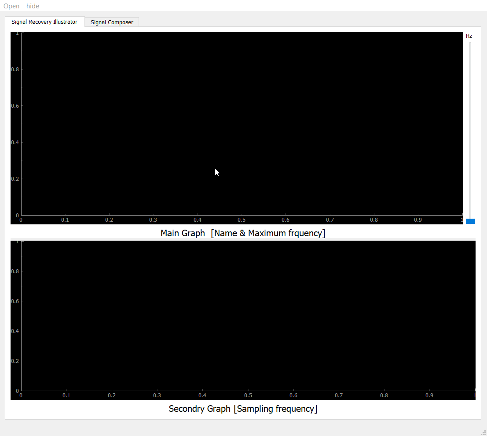
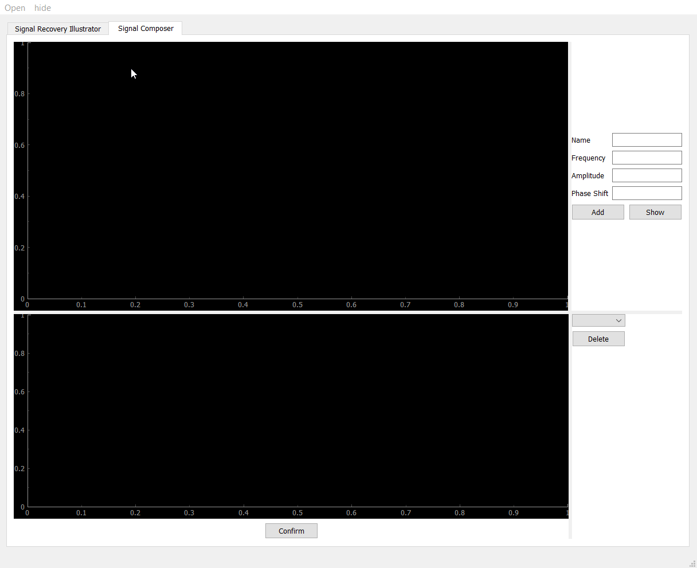

# Sampling & Reconstruction studio for signals
- [Description](#Description)
- [Sampling Theory Illustrator](#Sampling_Theory_Illustrator)
    - [Features](#features)
    - [Demos](#Demos)
        
- [Signal Composer](#Signal_Composer)
    - [Features](#features)
    - [Demos](#Demos)
        - [Image segmentation](#Image_segmentation)

- [Run-App](#Run-App)  
------
## Description
-  Sampling an analog signal is a crucial step for any digital signal processing system. The Nyquist–Shannon sampling theorem guarantees a full recovery of the signal when sampling with a frequency larger than or equal to the
bandwidth of the signal (or double the maximum frequency in case of real signals).
-----
## Sampling_Theory_Illustrator
### Features
- Load/Read signals from your pc and show it on
the main graph..
- The user can sample the given/read signal and see the sampled points highlighted on top of the signal.
- The user can change the sampling rate via a slider that range from 0 Hz to 3fmax, where fmax is the maximum
frequency in the read signal. 
- The app is able to reconstruct/recover the signal from the sampled points using Nyquist–Shannon sampling theorem.
- The user is able to see the reconstructed signal from the sampled points in the secondary graph.

------
### Demo

------
## Signal_Composer
### Features
- The application provides the user with a primitive signal composer where s/he can generate basic signals which is sum of sinusoidals to test and validate on the app.
- The user can generate these sinusoidals and each sinusoidal has a specific frequency, magnitude and phase shift
- The Composer has the following functionalities:
   - One graph to display the sinusoidal to be generated. A small panel should show beside the graph to control the frequency, magnitude and phase of the sinusoidal. Then, a button to confirm and add this sinusoidal to the summation.
   - The confirm button will save the resultant signal on your pc.
   - One graph to display the sum of the generated sinusoidals. There should be a combobox or menuitems through which the user can select one of the contributing sinusoidals and remove it via a delete button.


-----
### Demo

------
## Run-App
**_Run the application_**
```sh
python main.py
```
